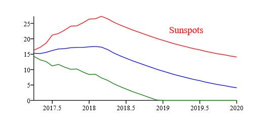

## Sunspot report drawing by python ##

_*An exercise drawing repo by reportlab tool.*_

### Source ###

* packages: `urllib`, `reportlab`
* data-source: [predicted-sunspot-radio-flux.txt](http://services.swpc.noaa.gov/text/predicted-sunspot-radio-flux.txt)

### Usage ###

```python 
git clone git@github.com:itabas016/simple-report.git ~
cd ~/simple-report
python main.py
```

> output -> ~/simple-report/report2.pdf

